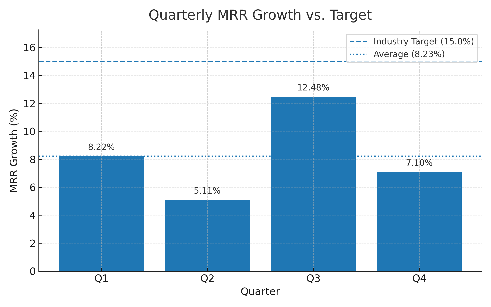

# SaaS MRR Growth Analysis
## 24f1000884@ds.study.iitm.ac.in
## Executive Summary
Our SaaS company's Monthly Recurring Revenue (MRR) growth shows signs of deceleration and inconsistency across the year. Despite a mid-year spike, overall growth remains well below the 15% industry target, risking revenue predictability and investor confidence.

## Key Findings
- Quarterly MRR growth (%): Q1 = 8.22, Q2 = 5.11, Q3 = 12.48, Q4 = 7.10.
- **Calculated average MRR growth: ** **8.23**.
- Performance is below the 15% target in all quarters.
- Volatility suggests dependency on a narrow set of segments/channels rather than a resilient, diversified growth engine.

## Visualization
_Embed the generated chart here once you run `analysis.py`:_

## Business Implications
- **Revenue risk**: Sub-target growth compounds to a widening gap vs. plan.
- **Customer concentration**: Over-reliance on a few segments/channels increases sensitivity to seasonality and competitive moves.
- **Capital efficiency**: Marketing and sales spend may be underperforming if CAC payback extends while growth lags.
- **Valuation pressure**: Prolonged under-target growth can compress multiples and limit fundraising options.

## Actionable Recommendations
1. **Primary: expand into new market segments.**
   - Prioritize 2–3 high-potential ICPs with distinct needs and willingness to pay.
   - Tailor positioning, messaging, and onboarding to each segment.
2. Strengthen demand generation mix
   - Introduce partner-led and product-led motions to complement paid channels.
   - Build segment-specific funnels and content.
3. Improve conversion and retention
   - Run pricing/packaging experiments aligned to segment value.
   - Double down on activation (time-to-value) and expansion (cross-sell/upsell) levers.
4. Instrumentation
   - Establish segment-level reporting for MRR, CAC payback, LTV/CAC, Net Revenue Retention, and win/loss insights.

---
**How to use this repo**  
1. Run `analysis.py` to calculate the average and generate `performance_chart.png`.  
2. Open this `README.md` to view the embedded chart and narrative.
